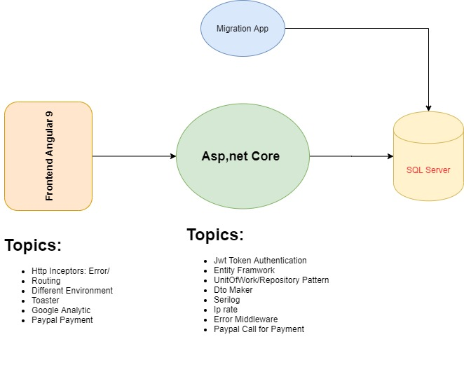

# Aspnet Core 3.1 + Angular 9+ Boilerplate
This is an asp.net core + Angular 9 Boilerplate 

This Boilerplate is a monolithic application works as Asp.net Core and Angualr 9. Here are the technologies I have used : 

**The structure** 

# **Asp.net Core API:**

An Asp.net core 3 simple api project. We create the asp.net core project separately as a back-end for the Angular app. 

**Naming and structure:** 

all the names starts with "Meys". Consider it as an example of a project. Then all the project can be named Mey.XXX like, 	Meys.Data, Meys.Service.Tests

Folder and Solution structure: 
I am using the solution folders to organize my solution, the solution folders are very useful specially when you use numbers in them. At a glance, I can tell what is my lowest layer in regards to the database. 

**Dependency Injection:** 

The default IOC of the asp.net core is used. There is an extension ServiceExtensions.cs in this file I have created an extension for IServiceLocation and in that we have injected all the required depenencies. 

**Entityframwork .net core:** 

ROM is EF Core. All the Data related projects are in 1.Data folder. 
Meys.Domain: contains all the entity of the database. we have to keep this project separate of any other items other than entities because any other project can include them. 
Meys.Data: all files related to the pattern of unit of work and general repository implemented in UnitOfWorkAndGeneralRepo folder. 

Fluent API Mapping: mapping between entities and the tables in the database is done via an overridden  method called OnModelCreating in the ApplicationDbContext. 

     protected override void OnModelCreating(ModelBuilder modelBuilder)
     {
	    modelBuilder.ApplyConfiguration(new UserMapping()); 
     }
And for each entity you need to create a Mapping file. For User we have this: 

    public class UserMapping : IEntityTypeConfiguration<User>
    {
        public void Configure(EntityTypeBuilder<User> builder) => builder.ToTable("User").HasKey(x => x.Id);        
    }

If you dont know about mapping please read the [Fluent Api in EntityFramework](https://www.entityframeworktutorial.net/efcore/fluent-api-in-entity-framework-core.aspx) . 

 

**JWT token Authentication:** 

1- frontend send its credentials 
2- back-end will check the credentials and if they are valid creates a token
3- the token is received by frontend and stored in storage. 
4- for all the subsequent calls to the backend the token is added to the header and is sent to the backend. 
5- backend reads the header and decrypts  token and validate it. 

**Dto maker :**

this is about how to sync  your models between Api  And Angular projects.  
As you may know there should be some models shared between the client app (angular) and your api. So when you prepare some data to send it to the client that call your api, you need to create a model that client expect to get. These models that are for data transfer called DTO(data transfer object). 
You need to have these models in two places, in your api solution and in your client application. And you have to keep these two sync all the time. Keeping two group of models in sync, in two places, is a pain and it not a good practice. It is best to find a way to produce one based on the other. One way to do this is to create and update the DTOs in the Api solution and automatically sync them with the client app. There is a package called MMT which does this for us.  
This package will read all your model in a specific folder 
You need to 
1- create a project 

2- remove any file in there and then edit the project file 

3- this is how you set the working and out put directory : 

    <Target Name="Convert" BeforeTargets="PrepareForBuild">
        <ConvertMain WorkingDirectory="../Meys.Common/Dtos/" ConvertDirectory="../../clientApp/"/>
      </Target>
      
4- remove the project from the build list of the solution, because you dont want all the model to be built every time you build your project. 

5- when you are changing a model or create a new model, then you build the dto maker manually and you will get the changes in the out put folder. 

**Angular 9,  Frontend app:**

**Migration App**: 

it is a console app written in c# to do the migration of the database with [this](https://fluentmigrator.github.io/articles/intro.html) package called : FluetnMigrator

